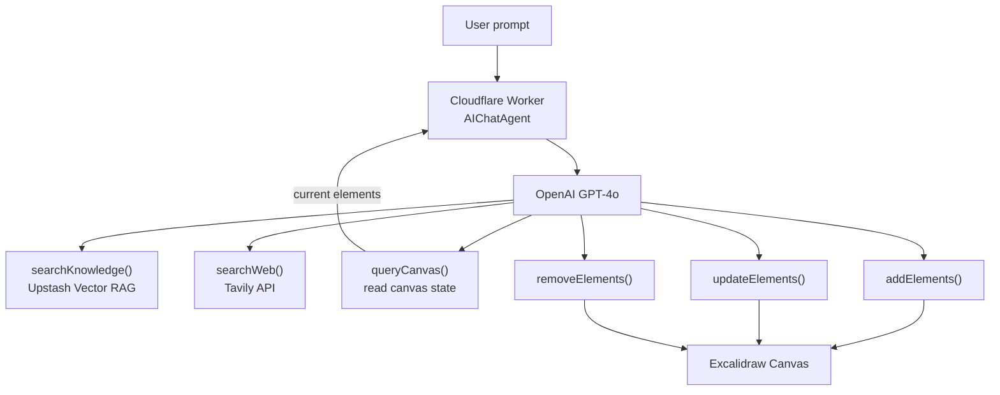

# SketchMind AI

An AI-powered diagramming agent that draws on an Excalidraw canvas from natural language — powered by Cloudflare Workers, OpenAI, and RAG.

---

## Demo

<!-- Add your demo video here -->

---

## How It Works



---

## Stack

- **Frontend** — React + Excalidraw
- **Agent** — Cloudflare Workers + AIChatAgent
- **LLM** — OpenAI GPT-4o via AI SDK
- **Knowledge base** — Upstash Vector
- **Web search** — Tavily
- **Evals** — Braintrust
- **AI Assistant** — Claude Code (used during development)

---

## Setup

```bash
git clone https://github.com/YOUR_USERNAME/sketchmind-ai
cd sketchmind-ai
npm install
```

Create `.dev.vars`:

```
OPENAI_API_KEY=sk-...
UPSTASH_VECTOR_REST_URL=https://...
UPSTASH_VECTOR_REST_TOKEN=...
TAVILY_API_KEY=tvly-...
```

Seed the knowledge base:

```bash
npm run embed
```

Run locally:

```bash
npm run dev
```

---

## Example Prompts

- `Draw how JWT authentication works step by step`
- `Draw a web app with a frontend, backend, and database`
- `Draw a microservices setup with an API gateway and 3 services`
- `Make the login box red`
- `Add a cache between the API and the database`

---

## Built With

This project was built with the help of [Claude Code](https://claude.ai/claude-code) — used for debugging, fixing rendering bugs in the Excalidraw integration, and iterating on the agent system prompt.

---
